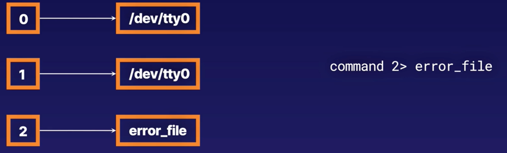
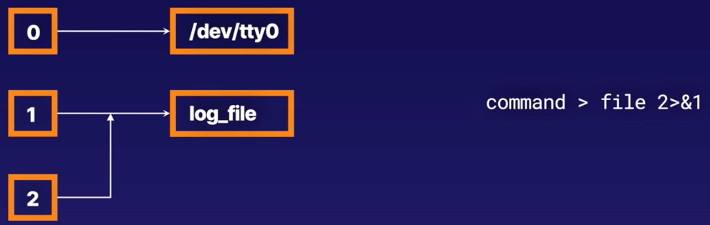
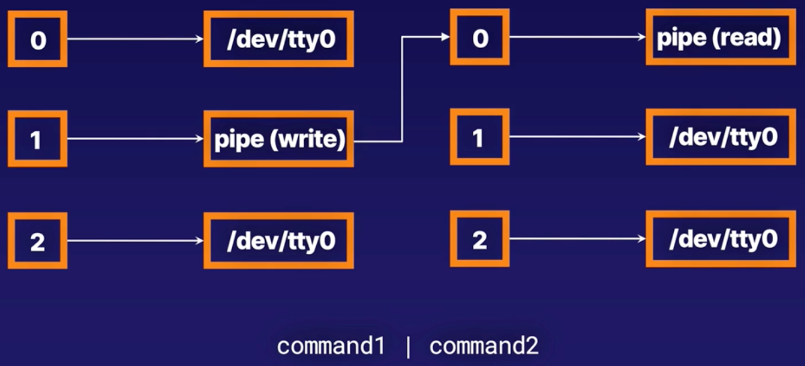

# Bash

- Basics of bash scripting
    - [What Is Bash Scripting?](#what-is-bash-scripting)
    - [Working with Special Characters](#working-with-special-characters)
    - [Implementing and/or Lists](#implementing-and-or-lists)
    - [Redirecting I/O, Utility Commands, and Pipes](#redirecting-io-utility-commands-and-pipes)
    - [Demoggification (or UUOC: Useless Use of cat)](#demoggification-or-uuoc-useless-use-of-cat)


## What is bash scripting?

- Bash scripts are like movie scripts: A movie script tells actors what to say at what time, while Bash scripts tell Bash **what to do at what time**.
- Bash scripts are a **simple text file** containing a series of commands we want to automate running rather than running them.
- We need to remember to set the **execute** bit on a file before we try to run the script, and that the script should start with a **"shebang"**.

> The shebang<br>
> `#!/bin/sh`

<br><br>
## Working with Special Characters

Common Special Characters Used in Bash
|Character | Function |
|---|---|
| `" "` or `' '`| Denotes whitespace. Single quotes preserve literal meaning; double quotes allow substitutions.|
|`$`| Denotes an expansion (for use with variables, command substitution, arithmetic substitution, etc.)|
| `\ `|Escape character. Used to remove "specialness" from a special character.|
|`#`|Comments. Anything after this character isn't interpreted.|
|`=`|Assignment|
|`[]`or `[[]]`|Test; evaluates for either true or false|
|`!`| Negation|
|`>>` `>` `<`|Input/output redirection|
| `\|`|Pipe. Sends the output of one command to the input of another.|
|`*` or `?`|Globs (aka, wildcards). ? is a wildcard for a single character.|


<br><br>
## Environment varaiables

- You can access all environment varaiables by simply running `env` command in your terminal

    ```shell
    env

    TERM_PROGRAM=Apple_Terminal
    SHELL=/bin/bash
    OLDPWD=/Users
    USER=alex
    PATH=/usr/local/bin:/usr/bin:/bin:/usr/sbin:/sbin
    PWD=/Users/alex
    LANG=en_GB.U
    HOME=/Users/alex
    ```

- Then you can access each `env` variable by prefixing its name with `$` (i.e. `$PWD` also see example below):

    ```bash
    #!/bin/bash

    echo "Creating a folder in $PWD/backup"
    mkdir backup
    ```

<br><br>
## Implementing and/or Lists

- **AND** list **`&&`** 

    A string of commands where the next command is only executed if the previous command exited with **a status of zero**.

- **OR** list **`||`**

    A string of commands where the next command is only executed if the previous command exited with **a non-zero status**.


<br>

**Exit statuses**
- **Zero Exit Status**

    Implies the script or program ran to completion and everything is fine.
- **Non-Zero Exit Status**

    Results can vary based on the script or program that generated the exit status.

<br>
<br>

> **To print the exist status of the script**<br>
> `echo $?`

> **To customize a exit code of your command you can use `exit <number>`**<br>
>`exit 127`


<br>
<br>
 
## Redirecting I/O, Utility Commands, and Pipes
||||
|---|---|---|
|**`>`**|Redirects to a file|`ls - 1R > directory-tree.txt`|
|**`>>`**|Redirects to a file, appending data|`echo mylabserver.com >> /etc/hosts`|
|**`<`**|Redirects file as input for a command|`sort < unsorted_list. txt`|

> NOTE: <br>
> You can also use both redirection within one command:<br>
>`sort < unsorted_list.txt > sorted_list.txt`


- **STDOUT**

    The strdout (`1`) is being redirected to a file.

    

<br>

- **STDERR**

    Use the `2>` to redirect error output of the command (if any) to the `error_file`

    

<br>

- **redirect both**

    


<br><br><br>

**Create your own file descriptor**

```shell
echo "abc 123" > file
exec 5<> file
read -n 3 var <&5
echo $var
exec 5>&-
```

### Utility Commands
|Command|Description|
|---|---|
|`sort`|Sorts input and prints a sorted output
|`uniq`|Removes duplicate lines of data from the input stream
|`grep`|Searches incoming lines for matching text
|`fmt`|Receives incoming text and outputs formatted text
|`tr`|Translates characters
|`head`/`tail`|Outputs the first/last few lines of a file
|`sed`|Stream Editor: More powerful than tr as a character translator
|`awk`|An entire programming language designed for constructing filters. Very powerful and complex.


### Pipe

- Redirect output of first command to a second with **`|`**

    


## Demoggification (or UUOC: Useless Use of cat)
> Demoggification on the high level is defined as remuving useless use of `cat`s.


- **Bad practice**
    ```shell
    $ cat /etc/passwd | grep rob
    rob::1000:1000: rob:/home/rob:/bin/bash
    ```
    - This will result in long running time when working on large files. 

- **Good practice**
    - Instead you should use `grep` function to search through the file for content. 

    - Search (`grep`) for `rob` in the file under the path `/etc/passwd`
    ```shell
    $ grep rob /etc/passwd
    rob:x:1000:1000:rob:/home/rob:/bin/bash
    ```
    - Redirect `<` file output to `grep` command and serach for `rob`
    ```shell
    $ grep rob </etc/passwd
    rob::1000:1000: rob: /home/rob:/bin/bash
    ```

- **Bad practice**
    - Use netcat to probe the website, just to see that it exists. You can use this in the if statement to make sure that you web server has started before sending api request, or for monitoring, etc. 
    ```shell
    $ nc -z www. acloud.guru 80 >&/dev/null
    ```
    - But rather then running a separate binary, you should use example below.
- **Good practice**
    - Use build-in bash capability to open its own TCP port. 
    ```shell
    $ 2> /dev/null >/dev/tcp/www.acloud.guru/80
    ```
    - This should not make much differece for a samll scripts, but will improve performance in larger calculations. 

<br><br>
<hr><hr>

### Backup script example
- Create a file

    ```shell
    vim backup.sh
    ```
- Add backup script content
    ```bash
    #!/bin/bash
    # Backing up required files

    echo "Creating backup directory" && mkdir ~/backup 2> /dev/null|| echo "Directory already exists"
    echo 'Copying files' && cp /usr/bin/* ~/backup > log_file 2>$1

    grep -i denied log_file | tail -n 2

    exit 127
    ```

- Assign execution permission
    ```shell
    chmod 744 backup.sh
    ```
- Run the script
    ```shell
    ./backup.sh

    #Cleanup
    rm -rf ~/backup
    ```
<hr><hr>

<br><br>

## Variables

